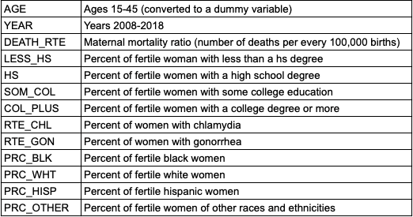
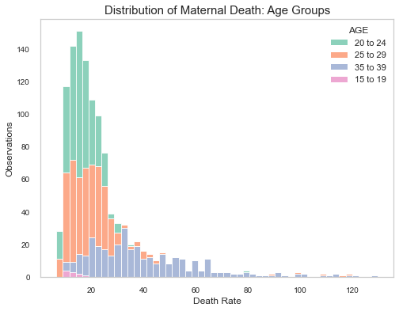
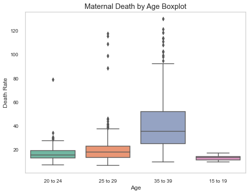

# Maternal Mortality in the United States - A Regression Analysis 

### Using regression analysis to learn more about the rising rate of maternal mortality in the United States 

**Author**: [Alexandra Bruno](mailto:alexandrabruno7898@gmail.com)

## Overview

Maternal mortality has been on an upward trend over the past several years. The Center of Disease Control and Preventation has stated the exact cause as to why this is occuring is still unknown. The purpose of this statistical analysis is to help us gain a better understanding as to why this may be occuring, and what factors have a larger impact on maternal mortality verses others. 

## Business Problem 

Preventable maternal death is a problem that occurs all over the globe. Although maternal death is less severe in the U.S. in comparison to underdeveloped countries, it is still an ongoing problem that we are faced with in the states. No mother should pass on what is supposed to be one of the most important days of her life. With statistcal analysis we can we what are some indicators there contribute to higher rates of maternal mortality. 

## Data

The data was obtained from three different sources, including 

- The Global Health Data Exchange
- The Center of Disease control and Prevention
- The Census Bureau.

I was able to scrape the data from the CDC using selenium. There is an option to export the data to a csv file, but the size of dataset I was requesting was very large and it would not export. I was able to get the census data with several API calls. The Data from the Global Health Data Exchange was easy to obtain, I just selected the paramaters for my dataset on their website and I was emailed a downloadable link. After cleaning and processing the data I merged the three sets on my AGE, STATE, and YEAR variables. 

My variables and description are as listed below. My target variable is DEATH_RTE

## What does the data look like?

Below we can get an idea of how the maternal death rate is distributed among the different age groups

This graphs show us that women in the older age ranges experience higher rates of maternal death. This is too be expected, as women who give birth at older ages are at increased risk for adverse outcomes during pregnancy. Additionally, we can see that the younger age ranges, especially 15-19 year olds, do no contribute to the maternal death nearly as much. 

## Methods 

For this regression analysis I chose to run an Ordinary Least Squares model. For evaluating where or not my variables impact the maternal death rate I am prioritizing p-values and R-sqaured and Adj. R-sqaured as an evaluation metric. 

I ran multiple models which can be found in the modeling notebook. I tested each of my independant variables againt the dependant variable individually, however I found these results to be biased since this showed each IV being statistically significant. 

## Results

